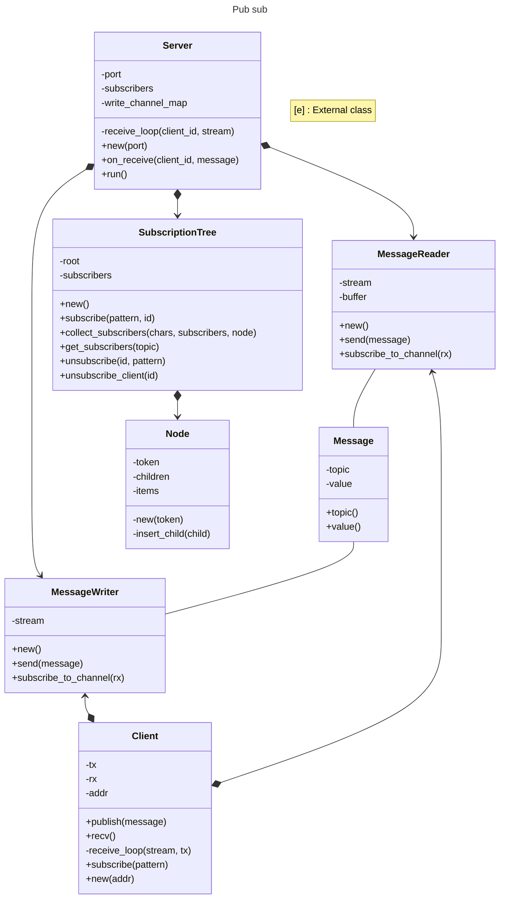

```mermaid
---
title: Pub sub
---
classDiagram
    note "[e] : External class"
    class Message {
        -topic
        -value
        +topic()
        +value()
    }
    class Server {
        -port
        -subscribers
        -write_channel_map
        -receive_loop(client_id, stream)
        +new(port)
        +on_receive(client_id, message)
        +run()
    }
    class Client {
        -tx
        -rx
        -addr
        +publish(message)
        +recv()
        -receive_loop(stream, tx)
        +subscribe(pattern)
        +new(addr)
    }
    class MessageWriter {
        -stream
        +new()
        +send(message)
        +subscribe_to_channel(rx)

    }
    class MessageReader {
        -stream
        -buffer
        +new()
        +send(message)
        +subscribe_to_channel(rx)
    }

    class Node {
        -token
        -children
        -items
        -new(token)
        -insert_child(child)
    }

    class SubscriptionTree {
        -root
        -subscribers
        +new()
        +subscribe(pattern, id)
        +collect_subscribers(chars, subscribers, node)
        +get_subscribers(topic)
        +unsubscribe(id, pattern)
        +unsubscribe_client(id)
    }

    Server *--> MessageWriter
    Server *--> MessageReader
    MessageWriter <--* Client
    MessageReader <--* Client
    MessageReader -- Message
    Message -- MessageWriter
    SubscriptionTree *--> Node
    Server *--> SubscriptionTree

```